# Peltier Water Cooled Sleeping Mat

I bought a water cooled sleeping mat but the station it came with was
evaporation based, extremely loud, and needed constant refilling. It also
barely worked in hot and humid weather so I decided to build a proper
replacement using a peltier module and a real water cooling setup.

It worked but the peltier could not keep up with the heat load so I scrapped
it. Everything is documented here anyway because the build itself came out
well and the failure is worth understanding.

## Parts

| Part | Details |
|---|---|
| Peltier module | TEC1 12706, 40x40mm, 12V |
| Water block | ARSYLID pure copper, 40x40x10mm |
| Pump | 280L/H brushless DC, 12V 5W, submersible |
| Power supply | 100W 12V switching PSU |
| Motor driver | BTS7960 43A H bridge |
| Buck converter | LM2596 or MP1584, 12V to 5V |
| Microcontroller | ESP32 |
| Coolant | 85% distilled water, 15% car coolant |
| Enclosure | 3D printed |

## Build

The core of the system is the peltier module sandwiched between a copper
water block on the cold side and a heatsink with fan on the hot side.

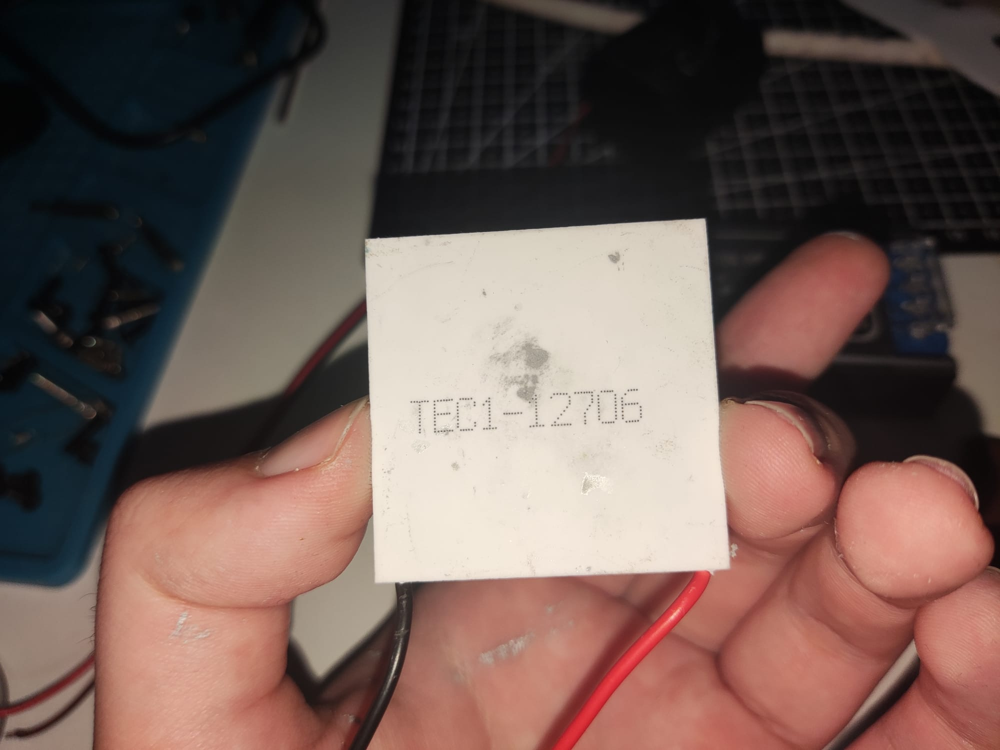

The water block sits against the cold face of the peltier and circulates
coolant through the mat.

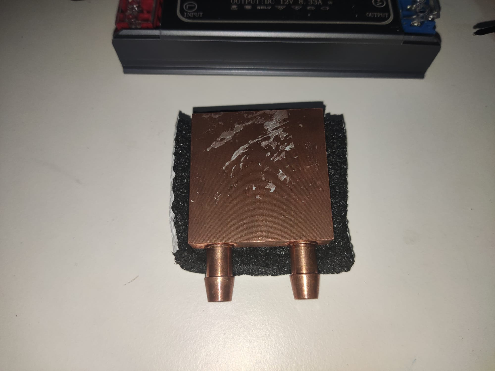

The heatsink and fan go on the hot side to dump heat out of the peltier.

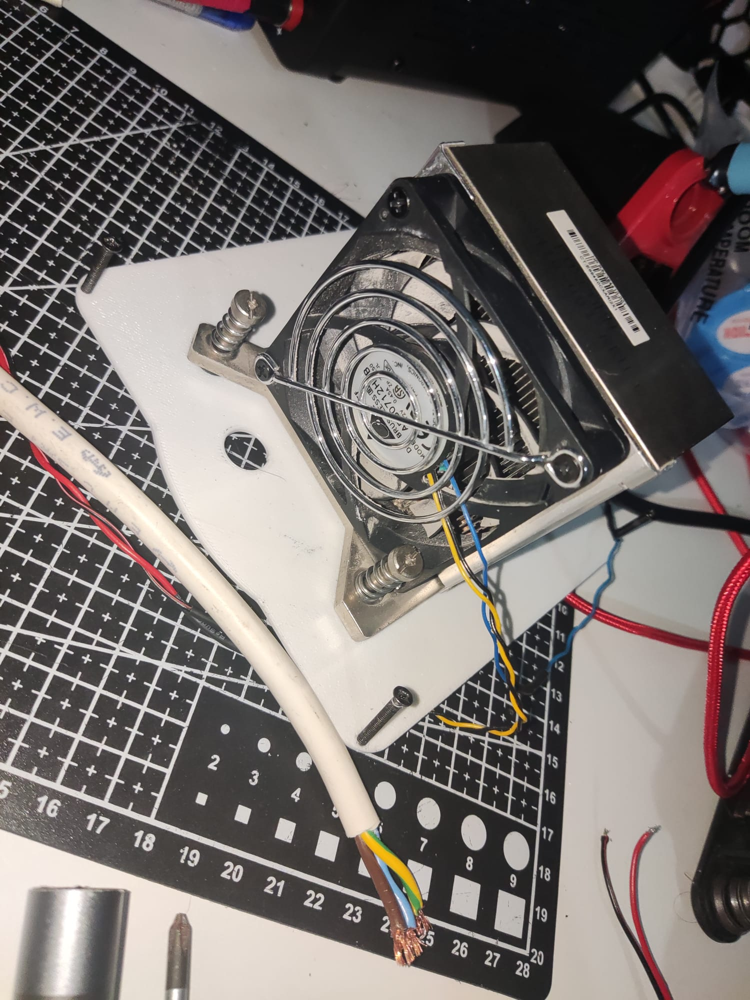

A brushless submersible pump circulates the coolant through the loop.

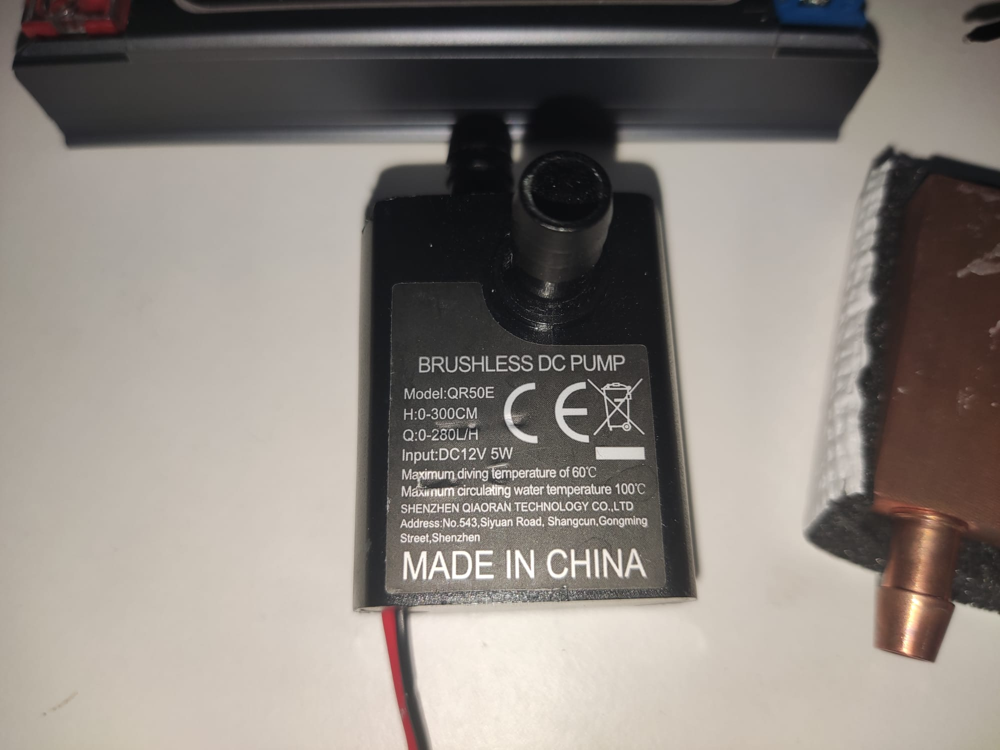

The whole system runs off a 100W 12V switching PSU.

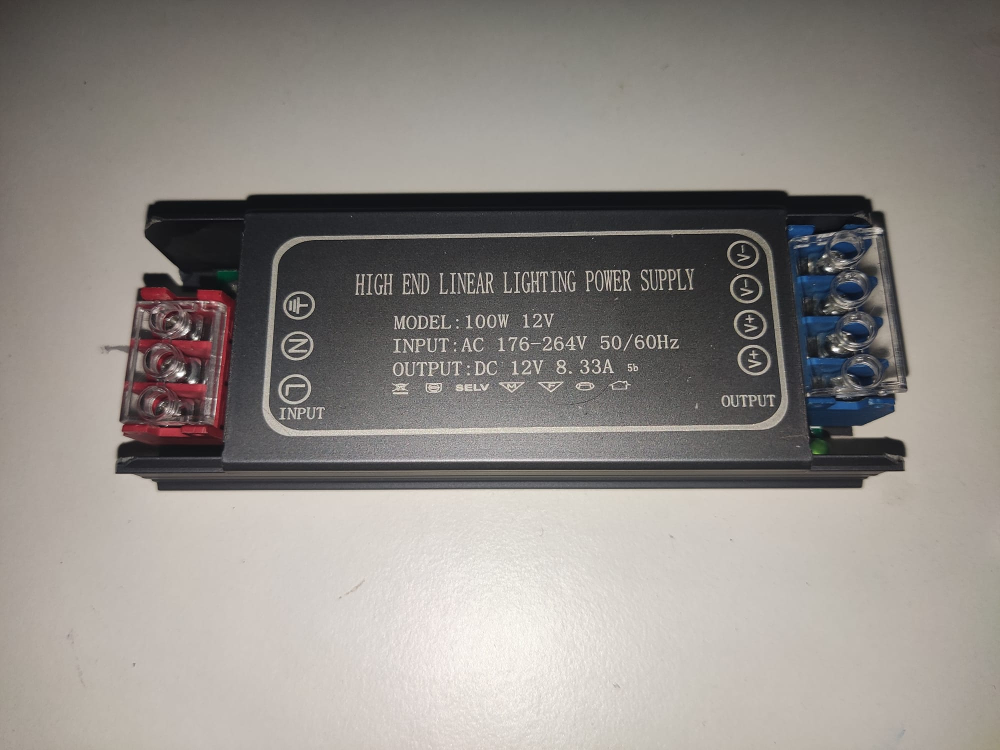

An ESP32 handles control. It hosts a web UI over WiFi for adjusting fan
speed, peltier power, and setting presets.

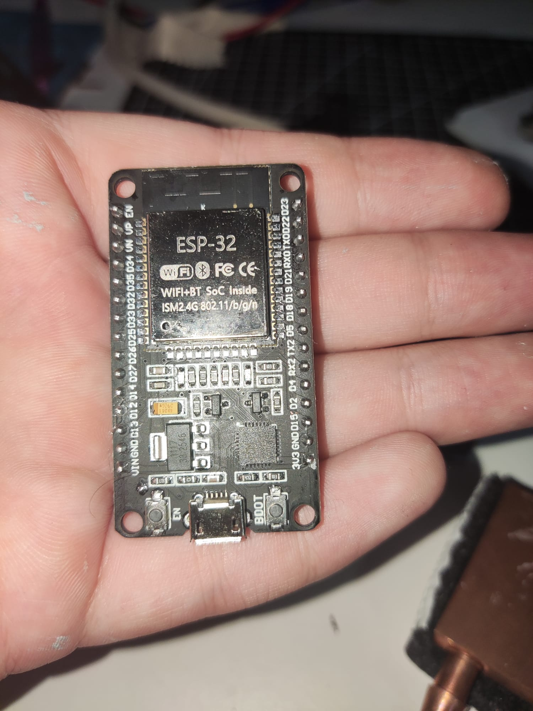

The BTS7960 motor driver handles PWM control of the peltier. A buck
converter steps 12V down to 5V to power the ESP32.

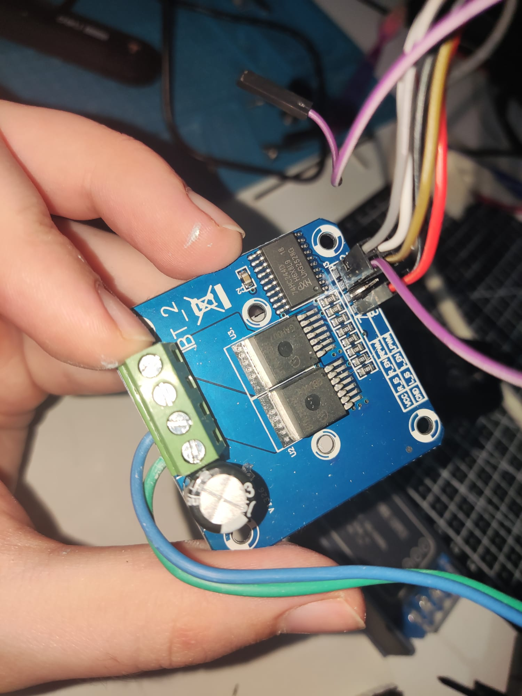

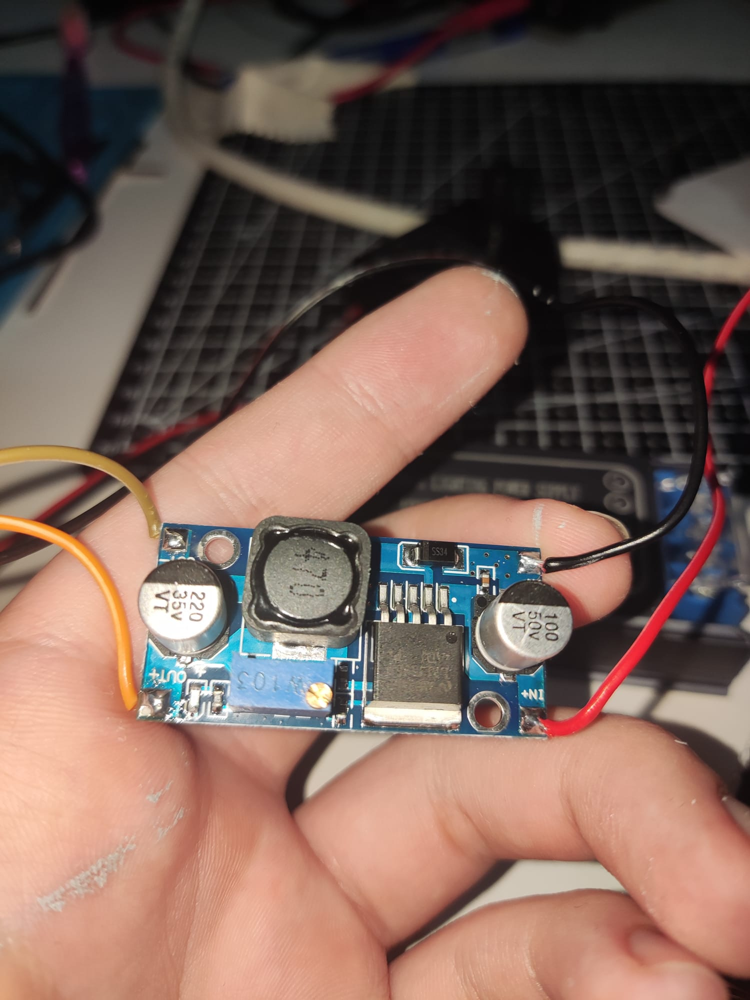

Everything sits inside a 3D printed enclosure. The water block was wrapped
in a sleeve cut from AC cable casing to insulate it and prevent condensation
on the outside.

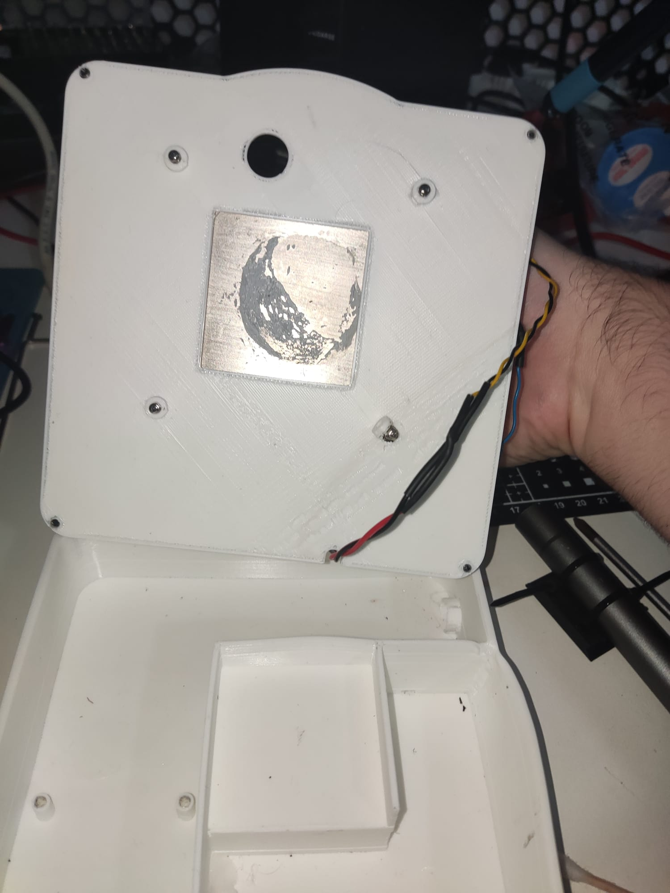

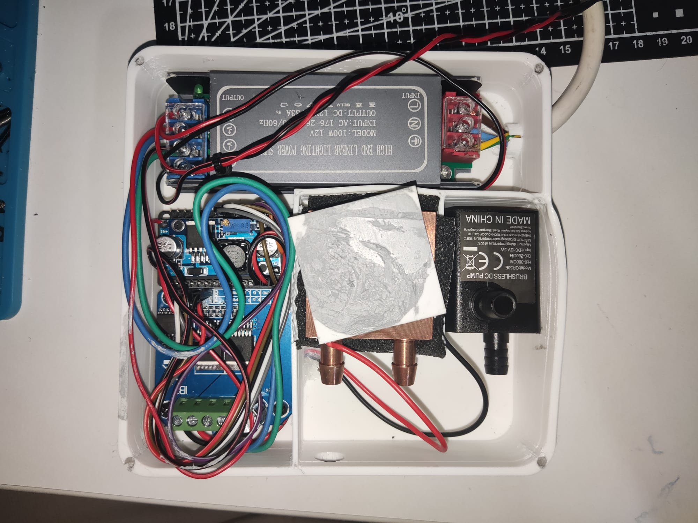

The coolant is an 85/15 mix of distilled water and automotive glycol to
prevent mineral deposits, corrosion and biological growth in the closed loop.

The mat connected and running.

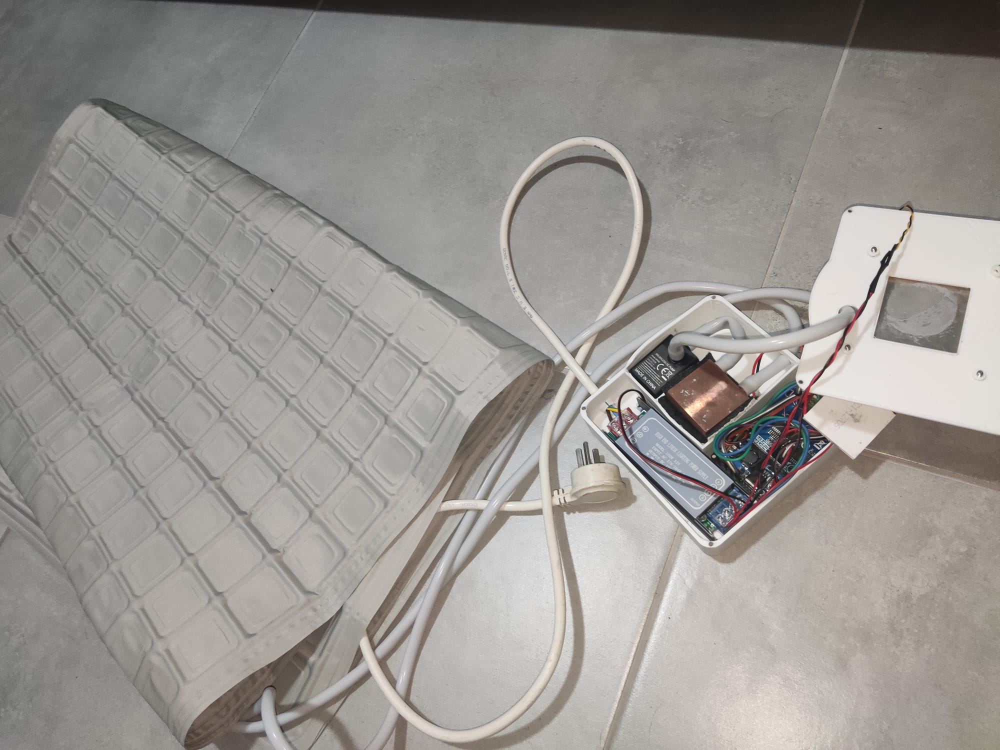

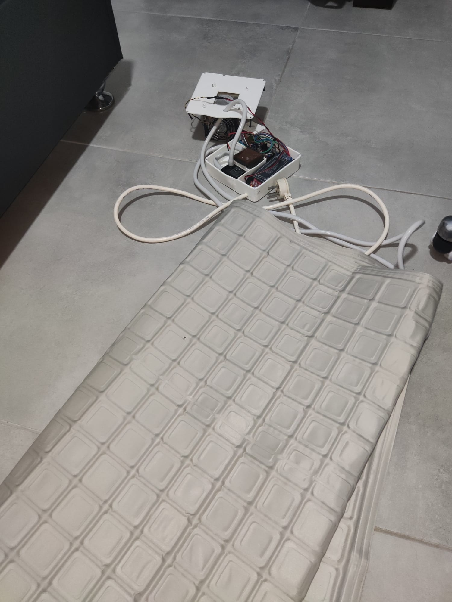

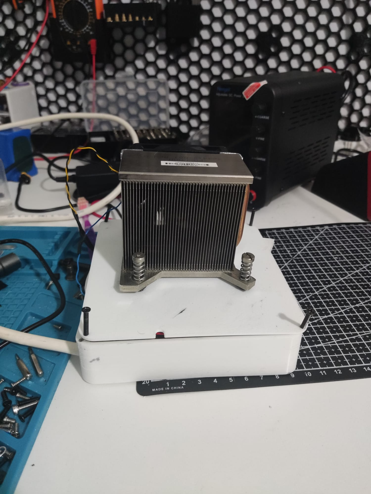

## Wiring

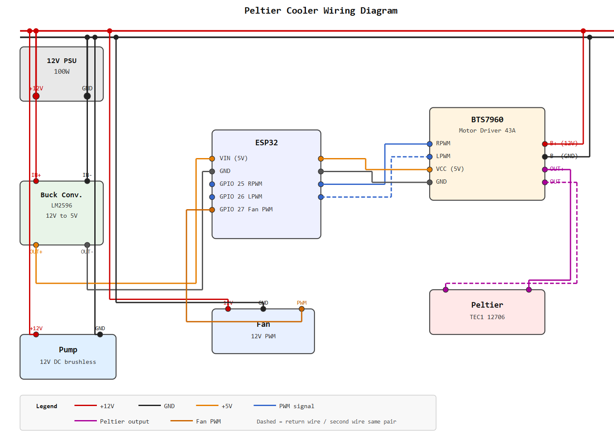

12V PSU positive rail to BTS7960 power input and to buck converter input.
PSU negative to shared ground. Buck converter output 5V to ESP32 VIN,
ground to shared ground. BTS7960 RPWM and LPWM to ESP32 GPIO 25 and 26.
Fan PWM to ESP32 GPIO 27. Water block on peltier cold side, heatsink and
fan on hot side.

## Why It Failed

The TEC1 12706 has a decent temperature differential on paper but in
practice it has to cool the water loop and reject that heat into the air at
the same time. When ambient temperature is high the hot side heatsink gets
warm fast, which compresses the usable temperature differential until the
peltier is basically doing nothing useful. A single module of this class
cannot cool a body contact mat in hot conditions. You would need stacked
modules, a much larger cold reservoir, or a compressor based chiller.

## What Worked Fine

The pump was extremely quiet, no issues at all. The BTS7960 ran cool and
gave smooth PWM control. The coolant loop had no leaks. The web UI worked
well and the presets were convenient.

## Lessons Learned

A peltier module moves heat, it does not generate cold. The usable
temperature differential shrinks as the hot side heats up, and in a hot
environment the hot side heatsink cannot dump heat fast enough to keep up.

The fix would be stacking multiple peltier modules, using a much larger
heatsink and fan on the hot side, or switching to a compressor based chiller
entirely. A single TEC1 12706 is not enough for a body contact cooling load.
